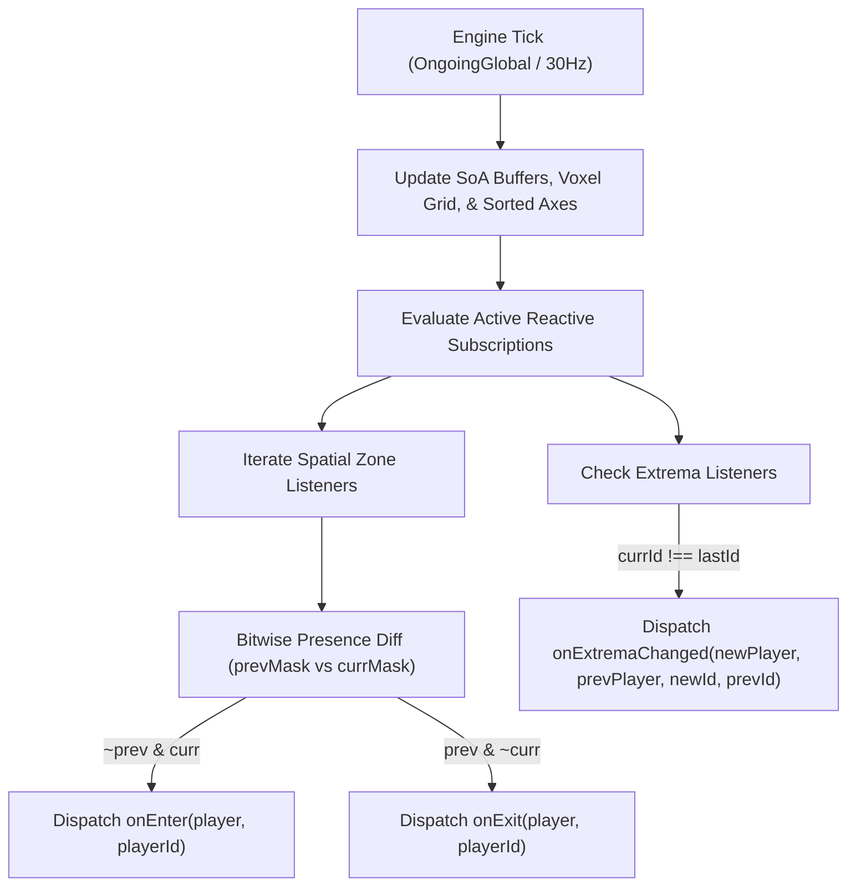

# Player Locations Module

<ai>

`PlayerLocations` is a high-performance, **Zero-Garbage-Collection (Zero-GC)** TypeScript spatial query engine built specifically for Battlefield 6 Portal experiences running an embedded QuickJS engine on a C++ server backend.

In Battlefield 6 Portal, querying player coordinates via engine Foreign Function Interface (FFI) calls (such as `mod.GetSoldierState`) in hot gameplay loops introduces noticeable C++ FFI overhead and garbage collection pressure. `PlayerLocations` eliminates this bottleneck by querying player positions once per tick at the start of the frame (`Events.OnTickStart`), transforming world coordinates into scaled integer representations inside cache-dense contiguous Typed Arrays, and providing a comprehensive suite of spatial, proximity, directional, and nearest-neighbor queries entirely within local JavaScript memory for all subsequent logic in the tick.

> **Note:** Since this module imports and relies on `Events`, **you must use the `Events` module as your only mechanism to subscribe to game events**—do not implement or export any Battlefield Portal event handler functions in your own code. See the [Events module](../events/README.md#known-limitations--caveats).

</ai>

---

## Quick Start

1. Install the package: `npm install -D bf6-portal-utils`
2. Import the module in your code:
    ```ts
    import { PlayerLocations } from 'bf6-portal-utils/player-locations';
    import { Events } from 'bf6-portal-utils/events';
    import { Vectors } from 'bf6-portal-utils/vectors';
    ```
3. Initialize the spatial tracking engine when the game mode starts:
    ```ts
    Events.OnGameModeStarted.subscribe(() => {
        PlayerLocations.initialize();
    });
    ```
4. Use any spatial query function anywhere in your game mode logic. Player positions, connection states, and spatial structures update automatically every tick once initialized.
5. Use [`bf6-portal-bundler`](https://www.npmjs.com/package/bf6-portal-bundler) to bundle your mod (it will automatically inline the code).

<ai>

### Example

```ts
import { PlayerLocations } from 'bf6-portal-utils/player-locations';
import { Events } from 'bf6-portal-utils/events';

// Example: 2.5D Capture Zone Check (Radius: 15m, Y bounds: 10m to 30m)
const CAPTURE_ZONE = {
    x: 100.0,
    z: -250.0,
    radius: 15.0,
    minY: 10.0,
    maxY: 30.0,
};

// Initialize tracking once the server and match are ready
Events.OnGameModeStarted.subscribe(() => {
    PlayerLocations.initialize();
});

Events.OnTickStart.subscribe(() => {
    // Pure count query: zero memory allocations, zero array writes
    const playersInZoneCount = PlayerLocations.findPlayersInCylinder(
        CAPTURE_ZONE.x,
        CAPTURE_ZONE.z,
        CAPTURE_ZONE.radius,
        CAPTURE_ZONE.minY,
        CAPTURE_ZONE.maxY
    );

    if (playersInZoneCount > 0) {
        // Find closest active player to the center of the objective
        const closestId = PlayerLocations.getClosestPlayerId(CAPTURE_ZONE.x, 20.0, CAPTURE_ZONE.z);
        if (closestId !== undefined) {
            const player = PlayerLocations.getPlayer(closestId);
            // ... execute objective scoring or UI updates ...
        }
    }
});
```

</ai>

---

## Architecture & Core Algorithms

The engine is engineered around cache-friendly memory layouts and algorithmic pruning to maximize QuickJS execution throughput:

```
                  ┌─────────────────────────────────────────────────────────┐
                  │          Engine Tick (OngoingGlobal / 30Hz)             │
                  └──────────────────────────┬──────────────────────────────┘
                                             │
                       ┌─────────────────────┴──────────────────────┐
                       │ Samples Connected Players via FFI Once     │
                       │ Scales World Meters -> Millimeter Integers │
                       └─────────────────────┬──────────────────────┘
                                             │
             ┌───────────────────────────────┼───────────────────────────────┐
             ▼                               ▼                               ▼
  ┌────────────────────────┐     ┌───────────────────────┐      ┌─────────────────────────┐
  │  Struct of Arrays      │     │  Linked Voxel Grid    │      │  Sorted Axis Arrays     │
  │  (posX, posY, posZ)    │     │  (512-Bucket Hash)    │      │  (Sweep-and-Prune)      │
  ├────────────────────────┤     ├───────────────────────┤      ├─────────────────────────┤
  │ • O(1) Pos by ID       │     │ • 25m 3D Voxels       │      │ • Incremental Sort      │
  │ • L1/L2 Cache Locality │     │ • O(cells) Sphere     │      │ • O(log N) AABB Pruning │
  │ • Integer Scaling      │     │ • Visit Stamping      │      │ • O(1) Altitude Extrema │
  └────────────────────────┘     └───────────────────────┘      └─────────────────────────┘
```

### 1. Struct of Arrays (SoA) Contiguous Buffers

Instead of an Array of Objects (`Array<{ x, y, z }>` which incurs GC pointer chasing and fragmented memory), `PlayerLocations` stores coordinates in parallel, contiguous Typed Arrays:

- `posX: Float32Array(100)`
- `posY: Float32Array(100)`
- `posZ: Float32Array(100)`
- `stateFlags: Uint8Array(100)`

**Key Benefits:**

- **$O(1)$ Direct Lookup**: Coordinates for player slot `id` are indexed directly via `posX[id]`, `posY[id]`, `posZ[id]`.
- **Cache-Dense Sequential Access**: 1-to-all distance sweeps scan contiguous 32-bit floating-point numbers in world meters, keeping memory lines hot in CPU L1/L2 cache.
- **Direct Metric Coordinates & Sub-Millimeter Precision**: Direct float storage in meters eliminates integer scaling multiplications (`* 1000`) and divisions (`/ 1000`) on every tick and query while maintaining sub-millimeter precision across a $[-10000, 10000]$ meter world.

---

### 2. Zero-GC Linked-List Spatial Voxel Grid

To perform fast volumetric proximity queries without testing all 100 players, the 3D world is partitioned into a uniform $25\text{m}$ voxel grid backed by a fixed-size flat array linked list:

- `gridHead: Int8Array(512)` (stores the head player ID for each of the 512 hash buckets, or `-1` if empty)
- `nextPlayer: Int8Array(100)` (stores the next player ID in the linked list chain)

$$\text{hash}(g_x, g_y, g_z) = \left((g_x \times 73856093) \oplus (g_y \times 19349663) \oplus (g_z \times 83492791)\right) \mathbin{\&} 511$$

**Key Benefits:**

- **Zero Allocations**: Inserting and clearing voxels requires only `gridHead.fill(-1)` and flat array writes—no object allocations, nodes, or dynamic collections.
- **$O(\text{cells})$ Sphere Queries**: `findPlayersInSphere` evaluates only the voxel buckets intersecting the bounding box of the sphere.
- **Visit Stamping (`queryVisited` + `queryToken`)**: In the event that distinct voxel coordinates map to the same hash bucket, a monotonically increasing `queryToken` stamped in `queryVisited: Uint32Array(100)` guarantees each candidate player is evaluated and added at most once per query with 0 array allocations.

---

### 3. Three Sorted Axis Arrays (Sweep-and-Prune)

The engine maintains three player-ID index arrays sorted along each respective coordinate axis:

- `sortedX: Uint8Array(100)`
- `sortedY: Uint8Array(100)`
- `sortedZ: Uint8Array(100)`

Every tick, these arrays are updated via **Insertion Sort**. Because players move continuous distances frame-to-frame, the arrays exhibit near-perfect temporal coherence, completing insertion sort in near $O(N)$ time.

**Key Benefits:**

- **Dynamic Axis Selection for 3D AABBs**: `findPlayersInAABB` performs binary searches (`_findLowerBound`, `_findUpperBound`) across $X$, $Y$, and $Z$ axes simultaneously, determines which axis contains the fewest candidate players, and iterates _only_ along that narrowest candidate slice. This prunes 90%+ of off-axis players immediately.
- **$O(1)$ Altitude Extrema**: `getHighestPlayerId`, `getLowestPlayerId`, `findKHighestPlayers`, and `findKLowestPlayers` read directly from the endpoints of `sortedY` without computing distances or scanning the whole player set.
- **Fast Directional Queries**: `findPlayersAbove`, `findPlayersBelow`, `findPlayersEastOf`, `findPlayersWestOf`, `findPlayersNorthOf`, and `findPlayersSouthOf` execute in $O(\log N + K)$ time via binary search.

---

### 4. Bounded Binary Heaps for $K$-Nearest / $K$-Farthest

For top-$K$ queries (`findKClosestPlayers` and `findKFarthestPlayers`), the engine maintains in-place binary heap structures (`heapDist: Float64Array(100)`, `heapId: Uint8Array(100)`).

- `findKClosestPlayers` maintains a **Max-Heap** bounded to capacity $K$.
- `findKFarthestPlayers` maintains a **Min-Heap** bounded to capacity $K$.
- Executes in $O(N \log K)$ time with **0 heap allocations**.

---

### 5. Reactive Spatial Event Subscriptions (Zero-GC Bitmask Diffing)

`PlayerLocations` provides high-level reactive event subscriptions (`onSphere`, `onCylinder`, `onAABB`, `onCrossAltitude`, `onHighestPlayerChanged`, etc.) that allow mod developers to respond instantly to spatial transitions without polling queries inside per-tick game loops.



**Key Architectural Properties:**

- **128-Bit Presence Bitmasks**: Each active spatial zone listener maintains 4 compact 32-bit integers (`mask0..mask3`), tracking the presence of all 100 player slots in just **16 bytes** of raw bitmask data.
- **Zero-Allocation Execution**: Transition evaluations perform bitwise operations (`&`, `|`, `^`, `~`) in CPU registers. Pre-cached engine player handles and primitive integer player IDs are dispatched directly to callbacks through `CallbackHandler.invoke` with **0 heap allocations per tick**.
- **Automatic Disconnect/Death Clean-up**: If a player disconnects or dies while inside a zone, the engine immediately dispatches `onExit(player, id)` and clears their presence bit, preventing stale exit triggers.

---

## Memory Footprint & QuickJS Performance

Under maximum load (100 connected and active players), `PlayerLocations` maintains a constant, deterministic memory footprint:

### 1. Pre-Allocated Contiguous Typed Arrays

| Buffer | Type & Elements | Purpose | Raw Data Size |
| :-- | :-- | :-- | :-- |
| **`posX`** | `Float32Array(100)` | Metric $X$ coordinates (meters) | **400 Bytes** |
| **`posY`** | `Float32Array(100)` | Metric $Y$ coordinates (meters) | **400 Bytes** |
| **`posZ`** | `Float32Array(100)` | Metric $Z$ coordinates (meters) | **400 Bytes** |
| **`stateFlags`** | `Uint8Array(100)` | Connected & Active bit flags | **100 Bytes** |
| **`gridHead`** | `Int8Array(512)` | Spatial grid hash table head pointers | **512 Bytes** |
| **`nextPlayer`** | `Int8Array(100)` | Spatial grid linked-list node pointers | **100 Bytes** |
| **`sortedX`** | `Uint8Array(100)` | $X$-axis sorted player ID indices | **100 Bytes** |
| **`sortedY`** | `Uint8Array(100)` | $Y$-axis sorted player ID indices | **100 Bytes** |
| **`sortedZ`** | `Uint8Array(100)` | $Z$-axis sorted player ID indices | **100 Bytes** |
| **`queryVisited`** | `Uint32Array(100)` | Query token visit stamping timestamps | **400 Bytes** |
| **`heapDist`** | `Float64Array(100)` | Exact $m^2$ distances for priority queues | **800 Bytes** |
| **`heapId`** | `Uint8Array(100)` | Player ID indices for priority queues | **100 Bytes** |
| **Subtotal (Raw Contiguous Data)** |  |  | **3,512 Bytes (~3.4 KB)** |

### 2. QuickJS Runtime Overhead (64-Bit Architecture)

| Component | QuickJS Internal Structure | Memory Size |
| :-- | :-- | :-- |
| **12 TypedArray & ArrayBuffer wrappers** | `JSObject` + `JSArrayBuffer` headers (~160 B each) | **~1,920 Bytes** |
| **`_players` (`(mod.Player \| undefined)[]`)** | Fast Array object + backing store for 100 object references | **~1,664 Bytes** |
| **`_scratchPos` (`Vector3`)** | Object header + 3 properties (`x`, `y`, `z`) | **~96 Bytes** |
| **5 Monomorphic Listener Arrays** | Fast Array objects for sphere, cylinder, aabb, plane & extrema | **~320 Bytes** |
| **Function Closures & Module Scope** | `JSFunctionBytecode` & namespace property table | **~2,500 Bytes** |
| **Subtotal (QuickJS Runtime Wrappers)** |  | **~6,500 Bytes (~6.3 KB)** |
| **Active Spatial Subscription (per zone)** | Listener (geom + 128-bit mask ~220 B) + Handle (`unsubscribe`, `update` ~160 B) | **~370–400 Bytes / active subscription** |

### 3. Total Memory & Zero-GC Guarantees

$$\text{Total Base Memory Footprint} \approx \mathbf{10.0\text{ KB}}$$

- **Per-Tick Heap Allocation Rate**: **0 Bytes / tick** (steady-state game ticks)
- **Per-Query Heap Allocation Rate**: **0 Bytes / query** (pure counts or when passing caller-provided `idsOut`/`playersOut` buffers)
- **Dynamic Zone Update Allocation Rate**: **0 Bytes / update** (in-place coordinate mutation)
- **Garbage Collector Pause Time**: **0.00 ms**

### 4. Execution Benchmarks & Allocation Rates

| Operation | Time Complexity | Typical CPU Time (QuickJS) | Allocation Rate (Bytes/Tick) | GC Pause |
| :-- | :-- | :-- | :-- | :-- |
| **`onGameTick` Update Cycle** | $O(N)$ near-linear | **~35–60 $\mu\text{s}$** (for 100 players) | **0 Bytes** | **0.00 ms** |
| **`getPosition`** (with `out`) | $O(1)$ | **~0.2 $\mu\text{s}$** | **0 Bytes** | **0.00 ms** |
| **`getDistanceSq` / `XZ`** | $O(1)$ | **~0.3 $\mu\text{s}$** | **0 Bytes** | **0.00 ms** |
| **`findPlayersInSphere`** | $O(\text{cells})$ | **~4–12 $\mu\text{s}$** | **0 Bytes** | **0.00 ms** |
| **`findPlayersInCylinder`** | $O(\log N + K)$ | **~3–8 $\mu\text{s}$** | **0 Bytes** | **0.00 ms** |
| **`findPlayersInAABB`** | $O(\log N + K)$ | **~4–10 $\mu\text{s}$** | **0 Bytes** | **0.00 ms** |
| **`findPlayersAbove` / `Below`** | $O(\log N + K)$ | **~2–5 $\mu\text{s}$** | **0 Bytes** | **0.00 ms** |
| **`getHighestPlayerId` / `Lowest`** | $O(1)$ | **~0.1 $\mu\text{s}$** | **0 Bytes** | **0.00 ms** |
| **`findKClosestPlayers`** (top-$K$) | $O(N \log K)$ | **~15–30 $\mu\text{s}$** | **0 Bytes** | **0.00 ms** |
| **`findKFarthestPlayers`** (top-$K$) | $O(N \log K)$ | **~15–30 $\mu\text{s}$** | **0 Bytes** | **0.00 ms** |
| **Spatial Zone Subscriptions** | $O(\text{zones} \times N)$ | **~2–6 $\mu\text{s}$** per active zone | **0 Bytes** | **0.00 ms** |

---

## API Reference

### `namespace PlayerLocations`

The namespace is not instantiated; all members are static or types. All functions accepting a player argument support either a numerical slot ID (`0..99`) or an engine `mod.Player` object.

### Exported Types

```ts
type PlayerZoneCallback = (player: mod.Player, playerId: number) => Promise<void> | void;

type PlayerExtremaCallback = (
    newPlayer: mod.Player,
    prevPlayer: mod.Player | undefined,
    newPlayerId: number,
    prevPlayerId: number | undefined
) => Promise<void> | void;

interface PrismVertex {
    x: number;
    z: number;
}

interface SphereHandle {
    unsubscribe(): void;
    update(x: number, y: number, z: number, radiusMeters?: number): void;
}

interface CylinderHandle {
    unsubscribe(): void;
    update(centerX: number, centerZ: number, radiusMeters?: number, minY?: number, maxY?: number): void;
}

interface AABBHandle {
    unsubscribe(): void;
    update(minX: number, minY: number, minZ: number, maxX: number, maxY: number, maxZ: number): void;
}

interface PrismHandle {
    unsubscribe(): void;
    update(vertices: PrismVertex[], minY?: number, maxY?: number): void;
}

interface PlaneHandle {
    unsubscribe(): void;
    update(threshold: number): void;
}

interface ExtremaHandle {
    unsubscribe(): void;
}

interface TargetExtremaHandle extends ExtremaHandle {
    update(x: number, y: number, z: number): void;
}
```

#### Lifecycle & Initialization Functions

| Function | Return Type | Description |
| :-- | :-- | :-- |
| `initialize()` | `void` | Explicitly initializes the spatial tracking engine, queries currently connected players via `mod.AllPlayers()`, and subscribes to `OngoingGlobal`, `OnPlayerJoinGame`, and `OnPlayerLeaveGame`. Safe to call multiple times (idempotent). Recommended to call inside `Events.OnGameModeStarted`. |
| `isInitialized()` | `boolean` | Checks whether `initialize()` has been called. |
| `setLogging(log?, logLevel?, includeRawError?)` | `void` | Attaches a custom logger and defines the minimum log level. |

---

#### Constants

| Constant      | Type     | Value | Description                                                      |
| :------------ | :------- | :---- | :--------------------------------------------------------------- |
| `MAX_PLAYERS` | `number` | `100` | Maximum supported player slots in Battlefield 6 Portal (`0-99`). |

---

#### Fast Accessor & Converter Functions

| Function | Return Type | Description |
| :-- | :-- | :-- |
| `getPlayer(player: number \| mod.Player)` | `mod.Player \| undefined` | Fast $O(1)$ lookup returning the cached engine `mod.Player` object without C++ FFI overhead. Returns `undefined` if disconnected or invalid. |
| `getPlayerId(player: number \| mod.Player)` | `number \| undefined` | Fast $O(1)$ lookup returning the integer slot ID (`0..99`). Returns `undefined` if disconnected or invalid. |
| `toPlayers(ids: (number \| undefined)[], playersOut?: (mod.Player \| undefined)[])` | `(mod.Player \| undefined)[]` | Resolves an array of player IDs into cached engine `mod.Player` objects (preserving 1:1 index alignment with `undefined` for non-connected/invalid players). Provide `playersOut` for zero allocations. |
| `toPlayerIds(players: (mod.Player \| undefined)[], idsOut?: (number \| undefined)[])` | `(number \| undefined)[]` | Resolves an array of engine `mod.Player` objects into integer slot IDs (preserving 1:1 index alignment with `undefined` for non-connected/invalid players). Provide `idsOut` for zero allocations. |

---

#### Player State Functions

| Function | Return Type | Description |
| :-- | :-- | :-- |
| `getPosition(player: number \| mod.Player, out?: Vectors.Vector3)` | `Vectors.Vector3 \| null \| undefined` | Returns world coordinates in meters for an active player. Pass `out` for zero-allocation reuse. Returns `null` if the player is connected but unspawned/inactive, or `undefined` if not connected. |
| `isPlayerConnected(player: number \| mod.Player)` | `boolean` | Checks if a player slot is currently connected to the server. |
| `isPlayerActive(player: number \| mod.Player)` | `boolean \| undefined` | Checks if a player is active (connected, spawned, and tracked with valid 3D coordinates). Returns `undefined` if the player is not connected. |
| `getConnectedPlayerCount()` | `number` | Returns the total count of currently connected players. |
| `getActivePlayerCount()` | `number` | Returns the total count of currently active (spawned) players. |
| `findConnectedPlayers(filterFn?: (player: mod.Player, id: number) => boolean, idsOut?: number[], playersOut?: mod.Player[])` | `number` | Populates optional output buffers with connected players and returns the count (Zero-GC). |
| `findActivePlayers(filterFn?: (player: mod.Player, id: number) => boolean, idsOut?: number[], playersOut?: mod.Player[])` | `number` | Populates optional output buffers with active (spawned) players and returns the count (Zero-GC). |

---

#### Distance Functions

> **Note on Return Values:** Distance functions return `undefined` if either player is not connected, or `Infinity` if either player is dead/inactive. This prevents JavaScript coercion bugs (e.g. `null <= 25` evaluating to `true`) and allows safe direct usage in `Math.min()`.

| Function | Return Type | Description |
| :-- | :-- | :-- |
| `getDistanceSq(playerA: number \| mod.Player, playerB: number \| mod.Player)` | `number \| undefined` | Returns squared 3D Euclidean distance in meters squared ($m^2$) between two active players. Avoids square root overhead. Returns `undefined` if either player is disconnected, or `Infinity` if inactive. |
| `getDistance(playerA: number \| mod.Player, playerB: number \| mod.Player)` | `number \| undefined` | Returns 3D Euclidean distance in meters between two active players. Returns `undefined` if either player is disconnected, or `Infinity` if inactive. |
| `getDistanceSqXZ(playerA: number \| mod.Player, playerB: number \| mod.Player)` | `number \| undefined` | Returns squared 2D horizontal distance in $m^2$ on the XZ plane between two active players (ignores vertical elevation). Returns `undefined` if either player is disconnected, or `Infinity` if inactive. |
| `getDistanceXZ(playerA: number \| mod.Player, playerB: number \| mod.Player)` | `number \| undefined` | Returns 2D horizontal distance in meters on the XZ plane between two active players. Returns `undefined` if either player is disconnected, or `Infinity` if inactive. |

---

#### Volumetric Proximity Queries

| Function | Return Type | Description |
| :-- | :-- | :-- |
| `findPlayersInSphere(x: number, y: number, z: number, radiusMeters: number, filterFn?: (player: mod.Player, id: number) => boolean, idsOut?: number[], playersOut?: mod.Player[])` | `number` | Fast 3D sphere query using the 3D Linked Voxel Grid. Returns matching count and optionally populates output buffers. |
| `findPlayersOutsideSphere(x: number, y: number, z: number, radiusMeters: number, filterFn?: (player: mod.Player, id: number) => boolean, idsOut?: number[], playersOut?: mod.Player[])` | `number` | Returns count of active players strictly outside the 3D sphere. |
| `findPlayersInCylinder(centerX: number, centerZ: number, radiusMeters: number, minY?: number, maxY?: number, filterFn?: (player: mod.Player, id: number) => boolean, idsOut?: number[], playersOut?: mod.Player[])` | `number` | Fast 2.5D cylinder query (horizontal XZ radius with optional vertical Y bounds). Returns matching count. |
| `findPlayersOutsideCylinder(centerX: number, centerZ: number, radiusMeters: number, minY?: number, maxY?: number, filterFn?: (player: mod.Player, id: number) => boolean, idsOut?: number[], playersOut?: mod.Player[])` | `number` | Returns count of active players strictly outside the 2.5D cylinder. |
| `findPlayersInAABB(minX: number, minY: number, minZ: number, maxX: number, maxY: number, maxZ: number, filterFn?: (player: mod.Player, id: number) => boolean, idsOut?: number[], playersOut?: mod.Player[])` | `number` | Fast 3D Axis-Aligned Bounding Box query using 3-Axis Sweep-and-Prune. Returns matching count. |
| `findPlayersOutsideAABB(minX: number, minY: number, minZ: number, maxX: number, maxY: number, maxZ: number, filterFn?: (player: mod.Player, id: number) => boolean, idsOut?: number[], playersOut?: mod.Player[])` | `number` | Returns count of active players strictly outside the 3D bounding box. |
| `findPlayersInPrism(vertices: PrismVertex[], minY?: number, maxY?: number, filterFn?: (player: mod.Player, id: number) => boolean, idsOut?: number[], playersOut?: mod.Player[])` | `number \| undefined` | Fast 2.5D polygonal prism query using 3-axis sweep-and-prune AABB filtering and ray-casting. Returns `undefined` if vertex count < 3 or > 32. |
| `findPlayersOutsidePrism(vertices: PrismVertex[], minY?: number, maxY?: number, filterFn?: (player: mod.Player, id: number) => boolean, idsOut?: number[], playersOut?: mod.Player[])` | `number \| undefined` | Returns count of active players strictly outside the polygonal prism. Returns `undefined` if vertex count < 3 or > 32. |

---

#### Directional & Extremum Queries

| Function | Return Type | Description |
| :-- | :-- | :-- |
| `findPlayersAbove(y: number, filterFn?: (player: mod.Player, id: number) => boolean, idsOut?: number[], playersOut?: mod.Player[])` | `number` | Returns count of active players located at or above elevation $Y$ ($Y_{\text{player}} \ge y$). |
| `findPlayersBelow(y: number, filterFn?: (player: mod.Player, id: number) => boolean, idsOut?: number[], playersOut?: mod.Player[])` | `number` | Returns count of active players located at or below elevation $Y$ ($Y_{\text{player}} \le y$). |
| `findPlayersEastOf(x: number, filterFn?: (player: mod.Player, id: number) => boolean, idsOut?: number[], playersOut?: mod.Player[])` | `number` | Returns count of active players located east ($+X$) of $X$ ($X_{\text{player}} \ge x$). |
| `findPlayersWestOf(x: number, filterFn?: (player: mod.Player, id: number) => boolean, idsOut?: number[], playersOut?: mod.Player[])` | `number` | Returns count of active players located west ($-X$) of $X$ ($X_{\text{player}} \le x$). |
| `findPlayersNorthOf(z: number, filterFn?: (player: mod.Player, id: number) => boolean, idsOut?: number[], playersOut?: mod.Player[])` | `number` | Returns count of active players located north ($-Z$) of $Z$ ($Z_{\text{player}} \le z$). |
| `findPlayersSouthOf(z: number, filterFn?: (player: mod.Player, id: number) => boolean, idsOut?: number[], playersOut?: mod.Player[])` | `number` | Returns count of active players located south ($+Z$) of $Z$ ($Z_{\text{player}} \ge z$). |
| `getClosestPlayerId(x: number, y: number, z: number, filterFn?: (player: mod.Player, id: number) => boolean)` | `number \| undefined` | Finds the single closest active player ID to target point. Returns `undefined` if none found. |
| `getFarthestPlayerId(x: number, y: number, z: number, filterFn?: (player: mod.Player, id: number) => boolean)` | `number \| undefined` | Finds the single farthest active player ID from target point. Returns `undefined` if none found. |
| `getHighestPlayerId(filterFn?: (player: mod.Player, id: number) => boolean)` | `number \| undefined` | Returns ID of the highest altitude active player ($O(1)$), or `undefined` if none found. |
| `getLowestPlayerId(filterFn?: (player: mod.Player, id: number) => boolean)` | `number \| undefined` | Returns ID of the lowest altitude active player ($O(1)$), or `undefined` if none found. |
| `findKHighestPlayers(k: number, filterFn?: (player: mod.Player, id: number) => boolean, idsOut?: number[], playersOut?: mod.Player[])` | `number` | Populates output buffers with top-$k$ highest altitude active players sorted highest to lowest ($O(k)$). |
| `findKLowestPlayers(k: number, filterFn?: (player: mod.Player, id: number) => boolean, idsOut?: number[], playersOut?: mod.Player[])` | `number` | Populates output buffers with bottom-$k$ lowest altitude active players sorted lowest to highest ($O(k)$). |
| `findKClosestPlayers(x: number, y: number, z: number, k: number, filterFn?: (player: mod.Player, id: number) => boolean, idsOut?: number[], playersOut?: mod.Player[])` | `number` | Populates output buffers with $k$ closest active players sorted closest-first ($O(N \log k)$ Max-Heap). |
| `findKFarthestPlayers(x: number, y: number, z: number, k: number, filterFn?: (player: mod.Player, id: number) => boolean, idsOut?: number[], playersOut?: mod.Player[])` | `number` | Populates output buffers with $k$ farthest active players sorted farthest-first ($O(N \log k)$ Min-Heap). |

---

#### Containment Check Functions

| Function | Return Type | Description |
| :-- | :-- | :-- |
| `isPlayerInCylinder(player: number \| mod.Player, centerX: number, centerZ: number, radiusMeters: number, minY?: number, maxY?: number)` | `boolean \| undefined` | Tests if player is active and inside a 2.5D cylinder (inclusive). Returns `undefined` if disconnected. |
| `isPlayerOutsideCylinder(player: number \| mod.Player, centerX: number, centerZ: number, radiusMeters: number, minY?: number, maxY?: number)` | `boolean \| undefined` | Tests if player is active and strictly outside a 2.5D cylinder. Returns `undefined` if disconnected. |
| `isPlayerInSphere(player: number \| mod.Player, centerX: number, centerY: number, centerZ: number, radiusMeters: number)` | `boolean \| undefined` | Tests if player is active and inside a 3D sphere (inclusive). Returns `undefined` if disconnected. |
| `isPlayerOutsideSphere(player: number \| mod.Player, centerX: number, centerY: number, centerZ: number, radiusMeters: number)` | `boolean \| undefined` | Tests if player is active and strictly outside a 3D sphere. Returns `undefined` if disconnected. |
| `isPlayerInAABB(player: number \| mod.Player, minX: number, minY: number, minZ: number, maxX: number, maxY: number, maxZ: number)` | `boolean \| undefined` | Tests if player is active and inside a 3D AABB bounding box (inclusive). Returns `undefined` if disconnected. |
| `isPlayerOutsideAABB(player: number \| mod.Player, minX: number, minY: number, minZ: number, maxX: number, maxY: number, maxZ: number)` | `boolean \| undefined` | Tests if player is active and strictly outside a 3D AABB bounding box. Returns `undefined` if disconnected. |
| `isPlayerInPrism(player: number \| mod.Player, vertices: PrismVertex[], minY?: number, maxY?: number)` | `boolean \| undefined` | Tests if player is active and inside a 2.5D polygonal prism (inclusive). Returns `undefined` if disconnected or vertices invalid (< 3 or > 32). |
| `isPlayerOutsidePrism(player: number \| mod.Player, vertices: PrismVertex[], minY?: number, maxY?: number)` | `boolean \| undefined` | Tests if player is active and strictly outside a 2.5D polygonal prism. Returns `undefined` if disconnected or vertices invalid (< 3 or > 32). |

---

#### Reactive Event Subscriptions & Dynamic Handles

> **Dynamic Zone Updates & Safety**: All reactive subscriptions return an interactive handle (`SphereHandle`, `CylinderHandle`, `AABBHandle`, `PrismHandle`, etc.). You can modify spatial properties (e.g. moving a payload zone or resizing a capture radius) on the fly via `handle.update(...)` with **0 heap allocations**. Subscriptions can be cancelled at any time via `handle.unsubscribe()`, which is idempotent and safely ignores subsequent `update(...)` calls.
>
> **Callback Requirements**: For multi-callback subscriptions (`onSphere`, `onCylinder`, `onAABB`, `onPrism`, `onCrossAltitude`, `onCrossEastWest`, `onCrossNorthSouth`), TypeScript enforces that at least one callback must be provided. Callbacks receive `(player: mod.Player, playerId: number)`. If only the secondary transition callback is needed, pass `undefined` as the first callback argument (e.g., `PlayerLocations.onSphere(x, y, z, r, undefined, onExit)`).

| Function | Return Type | Description |
| :-- | :-- | :-- |
| `onSphere(x, y, z, radiusMeters, onEnter?, onExit?)` | `SphereHandle` | Subscribes to events when any player enters or exits a 3D sphere. Callbacks receive `(player, id)`. Supports `.update(x, y, z, radius?)`. |
| `onCylinder(centerX, centerZ, radiusMeters, minY?, maxY?, onEnter?, onExit?)` | `CylinderHandle` | Subscribes to events when any player enters or exits a 2.5D cylinder. Callbacks receive `(player, id)`. Supports `.update(centerX, centerZ, radius?, minY?, maxY?)`. |
| `onAABB(minX, minY, minZ, maxX, maxY, maxZ, onEnter?, onExit?)` | `AABBHandle` | Subscribes to events when any player enters or exits a 3D AABB bounding box. Callbacks receive `(player, id)`. Supports `.update(minX, minY, minZ, maxX, maxY, maxZ)`. |
| `onPrism(vertices, minY?, maxY?, onEnter?, onExit?)` | `PrismHandle \| undefined` | Subscribes to events when any player enters or exits a 2.5D polygonal prism. Returns `undefined` if vertices are invalid (< 3 or > 32). Callbacks receive `(player, id)`. Supports `.update(vertices, minY?, maxY?)`. |
| `onCrossAltitude(y, onAbove?, onBelow?)` | `PlaneHandle` | Subscribes to events when any player crosses an altitude threshold ($Y$ elevation). Callbacks receive `(player, id)`. Supports `.update(threshold)`. |
| `onCrossEastWest(x, onEast?, onWest?)` | `PlaneHandle` | Subscribes to events when any player crosses an East-West threshold ($X$ axis). Callbacks receive `(player, id)`. Supports `.update(threshold)`. |
| `onCrossNorthSouth(z, onSouth?, onNorth?)` | `PlaneHandle` | Subscribes to events when any player crosses a North-South threshold ($Z$ axis). Callbacks receive `(player, id)`. Supports `.update(threshold)`. |
| `onHighestPlayerChanged(callback)` | `ExtremaHandle` | Subscribes to events when the identity of the highest active player changes `(newPlayer, prevPlayer, newId, prevId)`. |
| `onLowestPlayerChanged(callback)` | `ExtremaHandle` | Subscribes to events when the identity of the lowest active player changes `(newPlayer, prevPlayer, newId, prevId)`. |
| `onClosestPlayerChanged(x, y, z, callback)` | `TargetExtremaHandle` | Subscribes to events when the closest active player to target point changes `(newPlayer, prevPlayer, newId, prevId)`. Supports `.update(x, y, z)`. |
| `onFarthestPlayerChanged(x, y, z, callback)` | `TargetExtremaHandle` | Subscribes to events when the farthest active player from target point changes `(newPlayer, prevPlayer, newId, prevId)`. Supports `.update(x, y, z)`. |

---

## Usage Patterns

<ai>

### Pattern 1: Moving Payload / Dynamic Area Subscription

```ts
import { PlayerLocations } from 'bf6-portal-utils/player-locations';

// Track players entering/exiting a moving payload vehicle's aura
const payloadZoneHandle = PlayerLocations.onSphere(
    0,
    0,
    0,
    15.0,
    (player, playerId) => {
        console.log(`Player ${playerId} is now pushing the payload!`);
        // Grant ammo aura / buff
    },
    (player, playerId) => {
        console.log(`Player ${playerId} left payload aura.`);
        // Remove ammo aura / buff
    }
);

// On each payload movement step or waypoint progression:
export function onPayloadMoved(newX: number, newY: number, newZ: number, isStopped: boolean): void {
    // Dynamically shift coordinates and double radius when stopped (0 heap allocations)
    payloadZoneHandle.update(newX, newY, newZ, isStopped ? 30.0 : 15.0);
}

// When the match ends or payload is destroyed:
export function onRoundEnd(): void {
    payloadZoneHandle.unsubscribe();
}
```

</ai>

<ai>

### Pattern 2: High-Altitude Flight Ceiling Alert

```ts
import { PlayerLocations } from 'bf6-portal-utils/player-locations';

const FLIGHT_CEILING_Y = 800.0;

// Trigger warning when crossing above or returning below flight ceiling
const unsubCeiling = PlayerLocations.onCrossAltitude(
    FLIGHT_CEILING_Y,
    (pilot, playerId) => {
        // Play warning alarm sound or HUD warning
    },
    (pilot, playerId) => {
        // Clear HUD warning
    }
);
```

</ai>

<ai>

### Pattern 3: Dynamic VIP / King of the Hill Leader Tracking

```ts
import { PlayerLocations } from 'bf6-portal-utils/player-locations';

// Track when a new player takes the highest altitude lead
const unsubLeader = PlayerLocations.onHighestPlayerChanged((newHighest, prevHighest, newHighestId, prevHighestId) => {
    if (prevHighestId !== undefined) {
        console.log(`Player ${newHighestId} overtook player ${prevHighestId} for highest altitude!`);
    }
    // Update VIP scoreboard or 3D World Icon
});
```

</ai>

<ai>

### Pattern 4: Nearest Teammate Revive / Medic Aura

```ts
import { PlayerLocations } from 'bf6-portal-utils/player-locations';
import { Vectors } from 'bf6-portal-utils/vectors';

const scratchPos: Vectors.Vector3 = { x: 0, y: 0, z: 0 };

export function findNearestTeammate(medic: mod.Player): number | undefined {
    const medicPos = PlayerLocations.getPosition(medic, scratchPos);
    if (!medicPos) return undefined;

    const medicTeam = mod.GetPlayerTeam(medic);
    const medicId = PlayerLocations.getPlayerId(medic);

    // Filter predicate executes inside single linear pass with (candidatePlayer, candidateId)
    return PlayerLocations.getClosestPlayerId(medicPos.x, medicPos.y, medicPos.z, (candidatePlayer, candidateId) => {
        return mod.GetPlayerTeam(candidatePlayer) === medicTeam && candidateId !== medicId;
    });
}
```

</ai>

<ai>

### Pattern 5: Irregular Polygon Objective / Prismatic Capture Zone

```ts
import { PlayerLocations } from 'bf6-portal-utils/player-locations';

// Define a concave, irregular compound perimeter on the XZ ground plane
const COMPOUND_ZONE = [
    { x: 100.0, z: 100.0 },
    { x: 250.0, z: 120.0 },
    { x: 280.0, z: 200.0 },
    { x: 200.0, z: 260.0 },
    { x: 80.0, z: 180.0 },
];

// Subscribe to entry/exit transitions within the 2.5D polygon column (0m to 50m altitude)
const compoundHandle = PlayerLocations.onPrism(
    COMPOUND_ZONE,
    0.0,
    50.0,
    (player, playerId) => {
        console.log(`Player ${playerId} entered the compound capture zone.`);
        // Begin capture progress
    },
    (player, playerId) => {
        console.log(`Player ${playerId} exited the compound capture zone.`);
        // Halt capture progress
    }
);

// Query all active players inside the compound on demand
const defendersBuffer: number[] = [];
export function getDefendersInCompound(): number {
    return PlayerLocations.findPlayersInPrism(COMPOUND_ZONE, 0.0, 50.0, undefined, defendersBuffer) ?? 0;
}
```

</ai>

<ai>

### Pattern 6: High-Altitude Airstrike Warning

```ts
import { PlayerLocations } from 'bf6-portal-utils/player-locations';

const pilotsBuffer: mod.Player[] = [];

export function warnHighAltitudePilots(minAltitudeMeters: number): void {
    // Instantly queries Y-axis sorted bounds and populates pilot objects
    const count = PlayerLocations.findPlayersAbove(minAltitudeMeters, undefined, undefined, pilotsBuffer);

    for (let i = 0; i < count; ++i) {
        const pilot = pilotsBuffer[i];
        // Display SAM lock warning UI or sound
    }
}
```

</ai>

---

## Further Reference

- [Events module](../events/README.md) – Used for event handling and event subscriptions.
- [Vectors module](../vectors/README.md) – Used for vector math and conversions.
- [`bf6-portal-bundler`](https://www.npmjs.com/package/bf6-portal-bundler) – The bundler tool used to package TypeScript code for Portal experiences.
